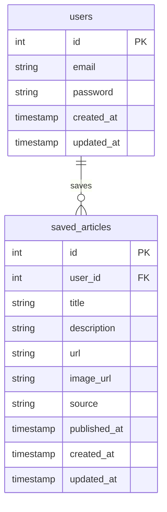

# Database Schema

## Entity Relationship Diagram



## Tables

### Users Table
- Primary key: `id` (auto-incrementing integer)
- `email` (unique, not null)
- `password` (not null, hashed)
- `created_at` (timestamp with timezone)
- `updated_at` (timestamp with timezone)

### Saved Articles Table
- Primary key: `id` (auto-incrementing integer)
- Foreign key: `user_id` (references users.id)
- `title` (not null)
- `description` (text)
- `url` (not null)
- `image_url` (nullable)
- `source` (not null)
- `published_at` (timestamp with timezone)
- `created_at` (timestamp with timezone)
- `updated_at` (timestamp with timezone)

## Indexes
- `users.email` (unique)
- `saved_articles.user_id`
- `saved_articles.url` (unique per user)

## SQL Creation Script

```sql
CREATE TABLE users (
    id SERIAL PRIMARY KEY,
    email VARCHAR(255) UNIQUE NOT NULL,
    password VARCHAR(255) NOT NULL,
    created_at TIMESTAMP WITH TIME ZONE DEFAULT CURRENT_TIMESTAMP,
    updated_at TIMESTAMP WITH TIME ZONE DEFAULT CURRENT_TIMESTAMP
);

CREATE TABLE saved_articles (
    id SERIAL PRIMARY KEY,
    user_id INTEGER REFERENCES users(id) ON DELETE CASCADE,
    title VARCHAR(255) NOT NULL,
    description TEXT,
    url VARCHAR(2048) NOT NULL,
    image_url VARCHAR(2048),
    source VARCHAR(255) NOT NULL,
    published_at TIMESTAMP WITH TIME ZONE,
    created_at TIMESTAMP WITH TIME ZONE DEFAULT CURRENT_TIMESTAMP,
    updated_at TIMESTAMP WITH TIME ZONE DEFAULT CURRENT_TIMESTAMP,
    UNIQUE(user_id, url)
);

CREATE INDEX idx_saved_articles_user_id ON saved_articles(user_id);
CREATE INDEX idx_saved_articles_url ON saved_articles(url);
``` 